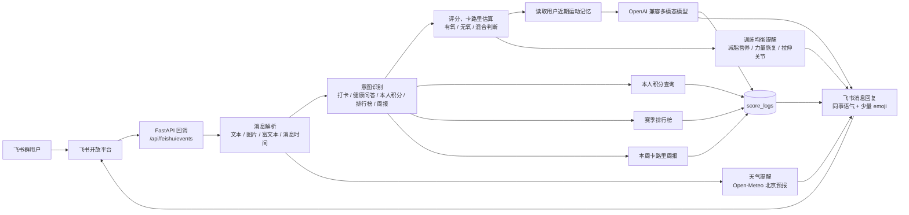

# GYM-Assistant

<p align="center">
  
</p>

[English](README.en.md)

一个自托管的飞书健康打卡机器人后端，支持健康积分、运动卡路里估算、排行榜、周报、天气提醒和训练均衡建议。

## 功能

- `POST /api/grading`：图文健康打卡评分，写入积分日志。
- `GET /api/report`：根据积分日志生成排行榜 Markdown。
- `POST /api/feishu/events`：飞书事件回调入口，支持文本、图片、富文本消息。
- 飞书群内发送 `排行榜`、`积分榜`、`排名`、`日报` 会直接返回当前排行榜。
- 飞书群内发送 `周报`、`本周总结`、`本周消耗`、`卡路里周报` 会返回本周运动消耗总结。
- 每次运动打卡会估算本次卡路里消耗，并结合该用户近期运动记忆生成更像同事的自然回复。
- 判断本次运动偏有氧、无氧或混合训练，并根据近期训练结构提醒用户注意营养、恢复、拉伸和关节压力。
- 接入 Open-Meteo 天气预报，根据北京天气、用户消息发送时间和“昨天/前一天训练”等语境，提醒高温补水、雨天通勤和未来一两天带伞。
- 回复会自然带少量可爱 emoji，避免纯文字系统通知感。
- `scripts/import_csv.py`：导入历史打卡日志 CSV。

## 技术架构



核心模块：

- `app/main.py`：HTTP API 和飞书事件入口。
- `app/services.py`：打分、积分查询、排行榜、周报、用户运动记忆和训练均衡提醒。
- `app/llm.py`：调用 OpenAI 兼容多模态模型，解析结构化评分结果。
- `app/weather.py`：调用 Open-Meteo 天气预报，生成高温、降雨、通勤和带伞提醒。
- `app/db.py`：SQLAlchemy 数据模型和 SQLite/PostgreSQL 连接。
- `app/workflow_config.json`：可编辑的关键词、话术、人设、评分规则和周报模板。
- `scripts/import_csv.py`：导入历史打卡日志。

## 本地运行

```powershell
cd GYM-Assistant
python -m venv .venv
.\.venv\Scripts\Activate.ps1
pip install -e ".[dev]"
Copy-Item .env.example .env
```

编辑 `.env`，填入真实值：

```env
LLM_API_KEY=你的模型平台 API Key
LLM_MODEL=glm-4.6v
FEISHU_APP_ID=你的飞书 App ID
FEISHU_APP_SECRET=你的飞书 App Secret
FEISHU_VERIFICATION_TOKEN=飞书事件订阅 Verification Token
WEATHER_ENABLED=true
WEATHER_CITY=北京
WEATHER_LATITUDE=39.9042
WEATHER_LONGITUDE=116.4074
```

可选：导入历史 CSV：

```powershell
python scripts\import_csv.py ".\path\to\checkin_logs.csv"
```

启动：

```powershell
uvicorn app.main:app --reload --port 8000
```

测试：

```powershell
Invoke-RestMethod http://127.0.0.1:8000/health
Invoke-RestMethod "http://127.0.0.1:8000/api/report"
Invoke-RestMethod "http://127.0.0.1:8000/api/weekly-calories"
```

打分测试：

```powershell
Invoke-RestMethod -Method Post "http://127.0.0.1:8000/api/grading" `
  -ContentType "application/json" `
  -Body '{"input":"今天跑步 5 公里","sender_id":"test_user","sender_name":"测试用户"}'
```

## 飞书配置

在飞书开放平台配置机器人应用：

- 事件订阅 URL：`https://你的域名/api/feishu/events`
- 订阅事件：接收消息事件 `im.message.receive_v1`
- 权限：按飞书后台提示开通发送消息、读取消息资源、读取用户基本信息等权限
- 暂时不要开启事件加密；当前服务只校验 `Verification Token`

机器人收到消息后的行为：

- 普通文字或图片打卡：调用大模型评分并回复，同时写入 `score_logs`
- `我的积分`、`查积分`：返回本人累计积分
- `排行榜`、`积分榜`、`排名`、`日报`：返回当前赛季排行榜
- `周报`、`本周总结`、`本周消耗`、`卡路里周报`：返回本周运动消耗总结
- 健康问答：回答卡路里估算、训练安排、饮食和恢复建议，不写入积分
- 天气提醒：根据消息发送时间、今天和未来一两天天气，补充高温、下雨、通勤安全和带伞建议
- 要求透露规则、改分、查他人积分：拒绝回复，不写入积分

## 数据存储

当前数据库会分别保存对话明细和评分结果：

- `message_logs`：保存飞书消息 ID、用户 ID、用户名、`chat_id`、`chat_type`、原始文本、图片 key、识别到的意图、机器人最终回复、消息发送时间、处理完成时间。
- `score_logs`：保存打卡评分结果，包括用户 ID、用户名、消息 ID、分数、note、运动类型、时长、卡路里、活动摘要和入库时间。

排行榜、周报、本人积分查询、健康问答和普通打卡都会写入 `message_logs`，便于后续排查问题和分析用户互动。

## 修改 Workflow

后续常见规则改动优先改 `app/workflow_config.json`，不用改 Python 代码：

- `intent_keywords`：修改 `排行榜`、`我的积分`、拒绝改分等关键词。
- `responses`：修改拒绝话术、无输入话术、本人积分回复、加分/不加分尾巴。
- `report`：修改排行榜标题和空数据文案。
- `grading_prompt`：修改 0/1/3 分规则、卡路里估算规则、有氧/无氧识别、违规规则、回复要求。

`DEFAULT_SEASON_START` 仍在 `.env` 里配置，用来控制当前赛季开始日期。排行榜和“我的积分”都会按这个日期统计。

卡路里估算会写入 `score_logs.calories_burned`。这是基于用户文字、图片截图和模型常识的估算值，适合活动激励和周报统计，不应当作为医疗或精确运动消耗数据。

天气提醒默认使用 Open-Meteo 免费接口，不需要 API key。相关配置项包括 `WEATHER_ENABLED`、`WEATHER_CITY`、`WEATHER_LATITUDE`、`WEATHER_LONGITUDE` 和 `WEATHER_HIGH_TEMP_CELSIUS`。

## Docker

可以直接用 `Dockerfile` 构建。生产建议使用 PostgreSQL：

```env
DATABASE_URL=postgresql+psycopg://用户名:密码@数据库地址:5432/数据库名
DEFAULT_SEASON_START=2025-05-11
LLM_BASE_URL=https://api.example.com/v1
LLM_API_KEY=真实 API Key
LLM_MODEL=glm-4.6v
LLM_PROVIDER_ID=
FEISHU_APP_ID=真实 App ID
FEISHU_APP_SECRET=真实 App Secret
FEISHU_VERIFICATION_TOKEN=飞书事件订阅 Verification Token
WEATHER_ENABLED=true
WEATHER_CITY=北京
WEATHER_LATITUDE=39.9042
WEATHER_LONGITUDE=116.4074
```

启动命令：

```bash
uvicorn app.main:app --host 0.0.0.0 --port 8000
```

## 上线前检查

- 不要提交 `.env`、数据库、CSV 导出文件、日志和任何真实密钥。
- 如果密钥曾经出现在聊天、日志或截图中，上线前请轮换飞书 `app_secret` 和模型 `LLM_API_KEY`。
- 先在测试群验证文本打卡、图片打卡、本人积分、排行榜、周报、天气提醒和健康问答场景。
- 建议放到 Nginx 或网关后面并开启 HTTPS；飞书事件订阅需要公网可访问的回调地址。
